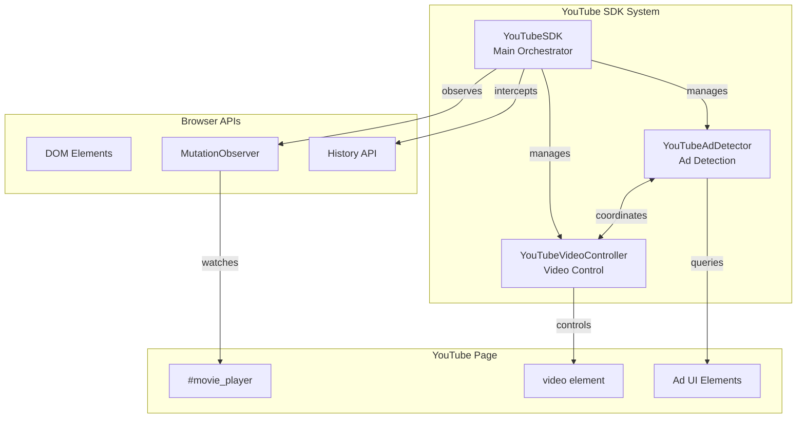
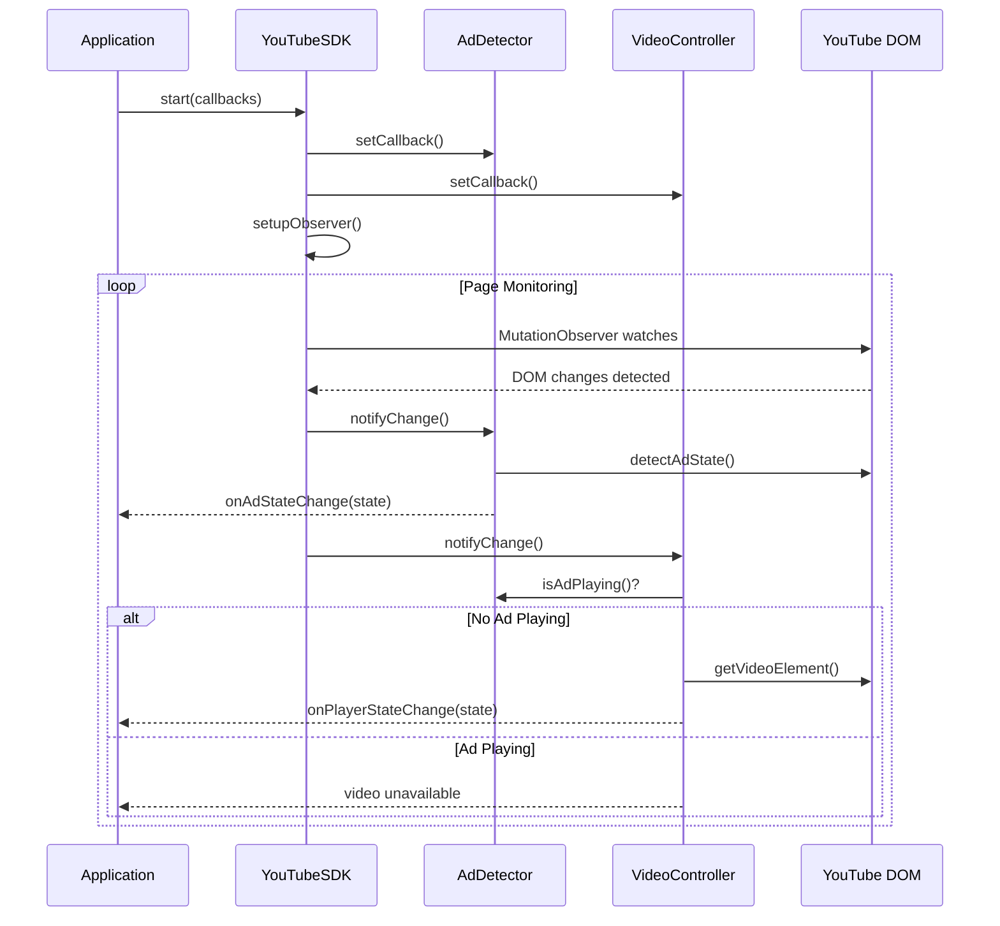
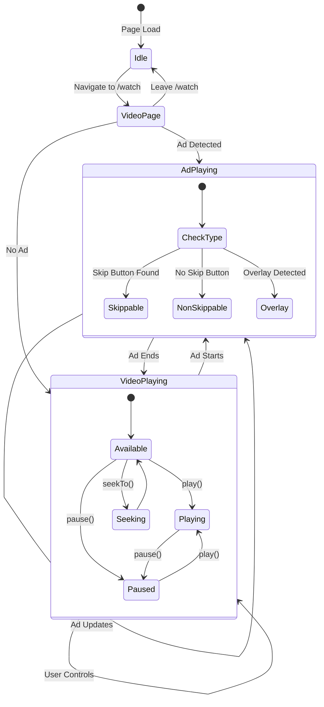

# YouTube SDK Documentation

## Overview

The YouTube SDK is a modular TypeScript library for interacting with YouTube's video player. It provides intelligent ad detection and video control capabilities, ensuring safe interaction with the video element only when ads are not playing.

## Architecture



## Component Flow



## State Management



## Core Components

### 1. YouTubeSDK (Main Orchestrator)

The main entry point that coordinates all components and manages the lifecycle.

**Responsibilities:**
- Initialize and manage sub-components
- Setup DOM observation (MutationObserver)
- Handle page navigation (History API)
- Provide unified API

**Key Methods:**
```typescript
start(options: {
  onAdStateChange?: AdStateCallback;
  onPlayerStateChange?: PlayerStateCallback;
}): void

stop(): void
getAdDetector(): YouTubeAdDetector
getVideoController(): YouTubeVideoController
```

### 2. YouTubeAdDetector

Specialized component for detecting YouTube ads.

**Detection Strategy:**
- Checks player element classes (`ad-showing`)
- Queries ad-specific DOM elements
- Identifies ad types (skippable, non-skippable, overlay)
- Extracts ad metadata (text, remaining time)

**Ad State Structure:**
```typescript
interface AdState {
  isAdPlaying: boolean;
  adType: 'none' | 'skippable' | 'non-skippable' | 'overlay';
  adText: string;        // e.g., "Ad 1 of 2"
  adRemainingTime: number; // seconds
}
```

### 3. YouTubeVideoController

Manages video playback with ad-awareness.

**Smart Video Access:**
- Returns `null` during ads (prevents interaction with ad videos)
- Caches video element for performance
- Provides safe playback controls

**Player State Structure:**
```typescript
interface PlayerState {
  isVideoAvailable: boolean;
  currentTime: number;
  duration: number;
  isPaused: boolean;
  volume: number;
}
```

## Usage Examples

### Basic Setup

```typescript
import { youtubeSDK } from '@src/lib/youtube-sdk';

// Start monitoring
youtubeSDK.start({
  onAdStateChange: (state) => {
    console.log('Ad state:', state);
    if (state.isAdPlaying) {
      console.log(`${state.adType} ad - ${state.adRemainingTime}s remaining`);
    }
  },
  onPlayerStateChange: (state) => {
    if (state.isVideoAvailable) {
      console.log(`Video: ${state.currentTime}/${state.duration}`);
    }
  }
});
```

### Video Control

```typescript
// Safe video control (automatically blocked during ads)
if (!youtubeSDK.isAdPlaying()) {
  youtubeSDK.play();
  youtubeSDK.seekTo(30);
  youtubeSDK.setVolume(0.5);
}

// Get current states
const adState = youtubeSDK.getCurrentAdState();
const playerState = youtubeSDK.getCurrentPlayerState();
```

### Direct Component Access

```typescript
// Access individual components
const adDetector = youtubeSDK.getAdDetector();
const videoController = youtubeSDK.getVideoController();

// Use component methods directly
if (!adDetector.isAdPlaying()) {
  const video = videoController.getVideoElement();
  if (video) {
    // Direct video element manipulation
    video.playbackRate = 1.5;
  }
}
```

## Integration with React

```typescript
import { useEffect } from 'react';
import { youtubeSDK } from '@src/lib/youtube-sdk';

function useYouTubeMonitor() {
  useEffect(() => {
    youtubeSDK.start({
      onAdStateChange: handleAdChange,
      onPlayerStateChange: handlePlayerChange
    });
    
    return () => youtubeSDK.stop();
  }, []);
}
```

## Detection Mechanisms

### Ad Detection Elements

The SDK monitors these DOM elements for ad detection:

| Element | Purpose | Selector |
|---------|---------|----------|
| Player Container | Main ad indicator | `#movie_player.ad-showing` |
| Ad Badge | Ad text display | `.ytp-ad-simple-ad-badge` |
| Skip Button | Skippable ad indicator | `.ytp-ad-skip-button` |
| Time Remaining | Ad duration | `.ytp-ad-duration-remaining` |
| Overlay Container | Overlay ads | `.ytp-ad-overlay-container` |

### Navigation Detection

The SDK intercepts and monitors:
- `history.pushState()` - Programmatic navigation
- `history.replaceState()` - URL replacement
- `popstate` event - Browser back/forward

## Safety Features

1. **Ad-Aware Video Access**: Video element is only accessible when no ads are playing
2. **Automatic State Reset**: States are cleared when leaving video pages
3. **Cached Elements**: Reduces DOM queries for better performance
4. **Graceful Degradation**: Returns safe defaults when elements are not found

## Performance Considerations

- **MutationObserver**: Only observes specific attributes and nodes
- **Singleton Pattern**: Prevents multiple instances and observers
- **Smart Caching**: Reduces repeated DOM queries
- **Conditional Setup**: Only active on `/watch` pages

## API Reference

### YouTubeSDK Methods

| Method | Returns | Description |
|--------|---------|-------------|
| `start(options)` | `void` | Start monitoring with callbacks |
| `stop()` | `void` | Stop monitoring and cleanup |
| `isAdPlaying()` | `boolean` | Check if ad is currently playing |
| `getVideo()` | `HTMLVideoElement \| null` | Get video element (null during ads) |
| `play()` | `boolean` | Play video (returns success) |
| `pause()` | `boolean` | Pause video |
| `seekTo(time)` | `boolean` | Seek to time in seconds |
| `setVolume(vol)` | `boolean` | Set volume (0-1) |
| `getCurrentTime()` | `number` | Get current playback time |
| `getDuration()` | `number` | Get video duration |

## Future Enhancements

Potential areas for expansion:

- [ ] Caption/subtitle management
- [ ] Quality control
- [ ] Playback speed control
- [ ] Theater mode detection
- [ ] Fullscreen management
- [ ] Playlist navigation
- [ ] Video metadata extraction
- [ ] Analytics and metrics

## Troubleshooting

### Common Issues

1. **Video element returns null**
   - Check if ads are playing
   - Verify you're on a `/watch` page
   - Ensure SDK is started

2. **Callbacks not firing**
   - Confirm SDK.start() was called
   - Check if page has navigated
   - Verify player element exists

3. **Controls not working**
   - Ads may be playing (check `isAdPlaying()`)
   - Video element might not be loaded
   - Check console for errors

## License

Internal use only. Part of the ListenUp Extension project.